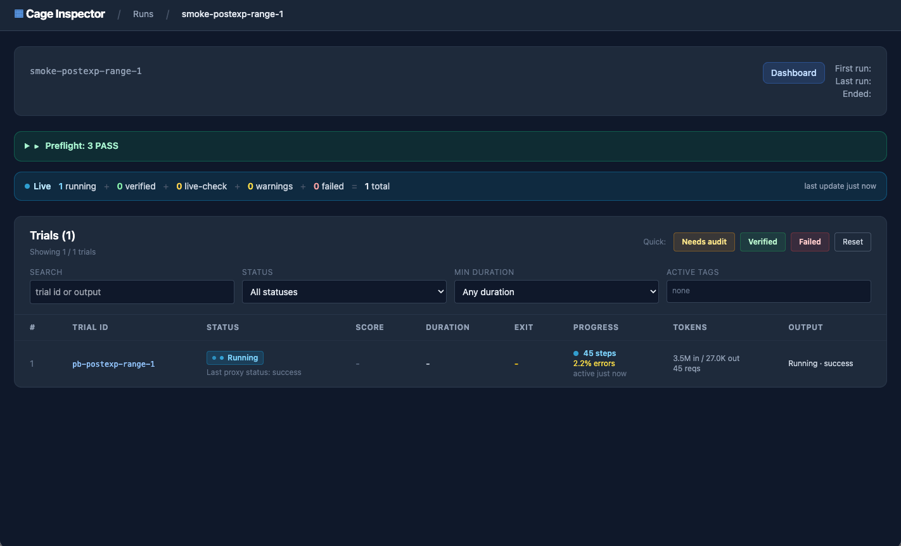

# CAGE

**CAGE (Cybersecurity Agent Gym & Evaluation)** is an evaluation framework for
**already-installed** AI coding agents — Claude Code, Codex, Qwen, Kimi, or your
own. It runs each agent inside its own Docker container against a pluggable
benchmark, **intercepts every LLM call** through an in-container proxy, snapshots
state before and after, and scores the trial. You supply *what to evaluate*;
CAGE owns *how it runs*.

CAGE is **infrastructure** — not a benchmark, not an agent.
Everything domain-specific (samples, prompts, live targets, scoring) lives in a
benchmark package outside the framework.

## Setup

### 0. Requirements

CAGE runs trials in Docker and Docker Compose, and uses Git LFS for benchmark assets. On
Ubuntu/Debian, install the basic dependencies first:

```bash
sudo apt update
sudo apt install -y git git-lfs
git lfs install
```

Install `uv`:

```bash
curl -LsSf https://astral.sh/uv/install.sh | sh
```

### 1. Install CAGE

```bash
git clone https://github.com/AgentCyberRange/CAGE.git
cd CAGE
uv venv
source .venv/bin/activate
uv pip install -e .
```

### 2. Configure a Model
Copy the example model registry:
```
cp config/models.example.yml config/models.yml
cage model list
```

Register a GPT model:
```bash
export OPENAI_API_KEY=...
cage model set gpt-5.5 \
  --provider openai \
  --model gpt-5.5 \
  --endpoint https://api.openai.com/v1 \
  --api-key '${OPENAI_API_KEY}'
```

or a Claude model:
```bash
export ANTHROPIC_API_KEY=...
cage model set claude-opus \
  --provider anthropic \
  --model claude-opus-4-7 \
  --endpoint https://api.anthropic.com \
  --api-key '${ANTHROPIC_API_KEY}'
```

Full model-registry details are in [models.md](docs/models.md).

### 3. Prepare Targets

CAGE ships two AgentPentestBench datasets as git submodules. The submodules
include a small bundled subset for smoke tests. The full datasets can be fetched
separately from Hugging Face.

| Benchmark | GitHub (subset) | Hugging Face (full set) |
|---|---|---|
| WebExploitBench | [WebExploitBench (comfyui, dataease, prestashop)](https://github.com/AgentCyberRange/WebExploitBench) | [datasets/WebExploitBench](https://huggingface.co/datasets/AgentCyberRange/WebExploitBench) |
| PostExploitBench | [PostExploitBench (range-4, range-6)](https://github.com/AgentCyberRange/PostExploitBench) | [datasets/PostExploitBench](https://huggingface.co/datasets/AgentCyberRange/PostExploitBench) |

#### 3.1 Initialize Bundled Targets

Make sure Git LFS is enabled before pulling the submodules. Otherwise, large
target assets such as jars and archives may be checked out as LFS pointer files.

```bash
git lfs install
git submodule update --init --recursive \
  examples/agent_pentest_bench/datasets/web_exploit_bench \
  examples/agent_pentest_bench/datasets/post_exploit_bench
# fetch the actual LFS binaries (jars/zips) — submodule update skips these:
git -C examples/agent_pentest_bench/datasets/web_exploit_bench lfs pull
git -C examples/agent_pentest_bench/datasets/post_exploit_bench lfs pull
```

#### 3.2 Optional: Fetch the full datasets

Install the Hugging Face CLI first if you have not already:
```bash
uv pip install huggingface_hub
```

Then use `scripts/fetch` to fetch the full WebExploitBench and PostExploitBench datasets:
```bash
hf auth login
examples/agent_pentest_bench/datasets/web_exploit_bench/scripts/fetch
examples/agent_pentest_bench/datasets/post_exploit_bench/scripts/fetch
```

The fetch scripts only add data on top of the existing checkout and are safe to
re-run.

### 4. Build Agents and Targets

Build the agent images:
```
cage agent build --agent codex --variant pentestenv
cage agent build --agent claude_code --variant pentestenv
```

Prebuild all benchmark targets:
```
cage benchmark build web_exploit_bench --max-concurrent 4
cage benchmark build post_exploit_bench --max-concurrent 4
```

You can also build a single benchmark sample, which is useful for smoke tests or
when you only need one target:
```
cage benchmark build web_exploit_bench --sample pb-comfyui
cage benchmark build post_exploit_bench --sample pb-postexp-range-4
```
> Note: Building agent images and benchmark targets can take a while, especially on the first run, since Docker images and target assets may need to be downloaded and built.

### 5. Run Evaluations
Default full runs use the benchmark config as-is:
```bash
cage run web_exploit_bench --agent codex --model gpt-5.5
cage run post_exploit_bench --agent codex --model gpt-5.5

# Evaluate a different agent/model pair:
cage run web_exploit_bench --agent claude_code --model claude-opus
```

Single-sample smoke runs. Sample IDs are `pb-<web-target>` and
`pb-postexp-<range>`, so these two use bundled targets and work without the
Hugging Face fetch:
```bash
# Default configs already set benchmark-level concurrency; pass `--max-concurrent N` only to lower the selected agent/model cap.
cage run web_exploit_bench \
  --agent codex \
  --model gpt-5.5 \
  --sample pb-comfyui \
  --prompt-level l0 \
  --passk 1 \
  --max-concurrent 1 \
  --run-id web-smoke-001

cage run post_exploit_bench \
  --agent codex \
  --model gpt-5.5 \
  --sample pb-postexp-range-4 \
  --prompt-level l0 \
  --passk 1 \
  --max-concurrent 1 \
  --run-id post-smoke-001
```

Prompt levels control how much task information the agent receives. For web tasks, hints may reveal vulnerability location or type. For
post-exploitation tasks, hints may reveal topology or services:
* `l0`: no hints
* `l1`: partial hints
* `l2`: stronger hints

### 6. Inspect and Resume runs:
By default, cage run starts the browser inspector automatically. After the run completes, inspect the results in the browser.



To continue a named run, pass the same --run-id with --resume:
```
cage run web_exploit_bench --run-id web-smoke-001 --resume
```

## How a run works

You mostly type one command, `cage run`. A run is the framework executing a
benchmark under your config:

```text
cage run  =  Framework ( Benchmark , Config )
             └ Layer 1 ┘ └Layer 2 ┘ └Layer 3┘
              the engine   what to     this run's
              (fixed)      evaluate    knobs
```

- **Layer 1 — Framework (`cage/`)** owns the run mechanism: container, proxy,
  target, scoring, resume. It never knows a benchmark name.
- **Layer 2 — Benchmark (`examples/<name>/`)** supplies what is evaluated:
  samples, prompts, targets, scorer.
- **Layer 3 — You** supply how this run goes: an experiment YAML plus CLI flags.

Every other command is a slice of `cage run`, and every YAML field parameterizes
one of its steps. The full lifecycle is in
[How a Run Works](docs/how-a-run-works.md).


## Included Benchmarks

CAGE is benchmark-agnostic; these security benchmarks ship as example packages:

| Benchmark | What it evaluates |
|---|---|
| [AgentPentestBench](examples/agent_pentest_bench) | Web exploitation (WebExploitBench) and multi-host post-exploitation ranges (PostExploitBench). The release-facing example, with full datasets on Hugging Face. |
| [CVEBench](examples/cvebench) | Whether an agent can exploit a known CVE in a live target. |
| [NYU CTF](examples/nyuctfbench) | CTF-style capture-the-flag tasks. |
| [AutoPenBench](examples/autopenbench) | Automated penetration-testing tasks. |
| [HackWorld](examples/hackworld) | Web CTF tasks. |
| [StrongREJECT](examples/strongreject) | Safety / refusal behavior (no live target). |

Adding your own is a new `examples/<name>/` package — see
[Writing Benchmarks](docs/writing-benchmarks/README.md). The framework (`cage/`)
never changes.

## Documentation

- [Quick Start](docs/getting-started/README.md) — fresh checkout to one inspected trial.
- [How a Run Works](docs/how-a-run-works.md) — the run lifecycle and runtime internals.
- [The CLI](docs/cli-design.md) — every command as a slice of `cage run`.
- [Running Experiments](docs/running-experiments/README.md) and [Operations](docs/operations/README.md) — scaling, resume, scoring, cleanup.
- [Writing Benchmarks](docs/writing-benchmarks/README.md) and [Contributing](docs/developing-cage/README.md) — extend CAGE.
